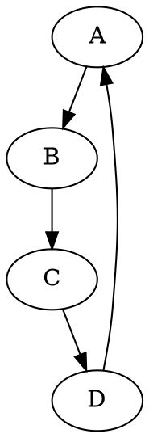
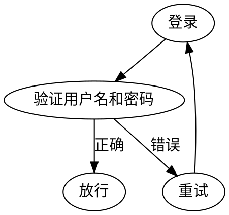

## Graphviz
Graphviz 是一个开源的图形可视化软件，主要用于绘制有向图和无向图。

用途：

1. 数据结构可视化：Graphviz 常用于显示数据结构，如抽象语法树或其他编程语言、工具或服务中的数据结构。

2. 软件设计和架构：通过Graphviz，开发者可以可视化系统组件、依赖关系和交互。

3. 网络拓扑图：用于显示网络设备和其连接的物理或逻辑视图。

4. 业务流程和工作流程图：描述组织或系统中的工作流程。

5. 其他任何需要图形表示的场景，例如状态机、决策树、组织结构图等。

优势：

1. 声明性语言：Graphviz 使用一种称为 DOT 的声明性图形描述语言。用户只需描述图形的元素（如节点和边）及其关系，而无需指定其在屏幕上的确切位置。这使得创建和修改图形变得非常简单。

2. 自动布局：Graphviz 的一个显著特点是其强大的自动布局工具，这意味着你不需要手动指定节点的位置；Graphviz 将自动为你找到一个有意义和易于阅读的布局。

3. 可扩展性：Graphviz 支持多种输出格式，如 PNG、SVG、PDF 等，这意味着你可以轻松地将其图形集成到其他文档、网页或应用程序中。

4. 灵活性：虽然 DOT 语言相对简单，但它提供了丰富的特性和属性，允许用户定制图形的外观，如颜色、形状、大小、标签、箭头样式等。

5. 跨平台：Graphviz 可在多种操作系统上运行，如 Windows、Linux 和 macOS。

6. 活跃的社区和广泛的应用：由于其开源性质，Graphviz 拥有一个活跃的社区，不断有新的工具和库被开发，以支持更多的用例和集成。

## 使用

Graphviz 使用 DOT 语言来描述图形。在 DOT 中，图分为**有向图**和**无向图**，使用`digraph`和`graph`关键字。

安装：

```
sudo apt install dot
```

- Digraph 有一个明确的起点和终点。

- Graph 没有明确的起点和终点。

### 节点(Node)

节点表示图中的一个实体，每一个节点都有唯一标识符。

### 边

边连接两个节点。在有向图中显示为一个箭头，在无向图中显示为一条线段。

- 有向图：`nodeA -> nodeB;`

- 无向图：`nodeA -- bodeB;`

### 属性

- `color` 元素颜色

- `label` 附加到元素上的文本标签

- `shape` 节点形状

- `style` 元素样式



渲染为图片：

```bash
dot -Tpng ./test.dot -o ./test.png
```

## 示例

一个容易的用户登录验证逻辑




## 参考
 - https://zhuanlan.zhihu.com/p/644358139
 - https://graphviz.org/documentation/
